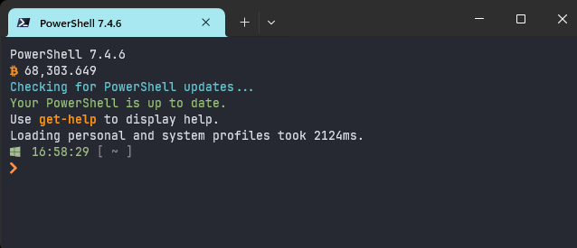

# PowerShell Profile

Feels almost as good as a Linux terminal.



<hr>

1.  Clone repo
```powershell
git clone https://github.com/tonytech83/powershell-profile.git
```

2. Execute `setup.ps1` as admin. This will install:

  - JetBrainsMono nerd font
  - Oh My Posh
  - Terminal Icons module
  - fzf
  - zoxide

3. Execute `setprofile.ps1`. This will copy `Microsoft.PowerShell_profile.ps1` into `C:\Users\<username>\Documents\PowerShell`

4.  Copy and paste `my_theme.omp.json` into `C:\Users\<username>\AppData\Local\Programs\oh-my-posh\themes`
