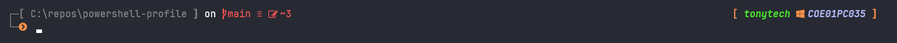

[](https://github.com/tonytech83/powershell-profile/actions/workflows/main.yml)

<h1 align="center">
PowerShell Profile
</h1>

**_Transform your Windows PowerShell into a powerful, beautiful, and productive terminal environment that rivals the best Linux shells. This comprehensive PowerShell profile brings together modern tools, elegant themes, and productivity-enhancing features to create a seamless command-line experience._**


#### Themes:

**_minimal.toml_**


**_minimal_one.toml_**


**_tonytech.omp.json_**


<hr>

## Prerequisites

- **Windows 10/11** with PowerShell 7+ installed
- **Administrator privileges** (required for setup script)

## Installation

#### 1. Clone the repository

```powershell
git clone https://github.com/tonytech83/powershell-profile.git
cd powershell-profile
```

#### 2. Execute `setup.ps1` as **admin**. This will install:

- JetBrainsMono Nerd Font
- Oh My Posh
- Terminal Icons module
- fzf (fuzzy finder)
- zoxide (smart cd command)

#### 3. Execute `setprofile.ps1` to setup profile.

```powershell
.\setprofile.ps1
```

#### 4. If you want to use any of my themes:

```powershell
# Copy theme file to Oh My Posh themes directory
Copy-Item "themes\<theme-name>" "$env:POSH_THEMES_PATH\"

# Example for minimal theme:
Copy-Item "themes\minimal.toml" "$env:POSH_THEMES_PATH\"
```

#### 5. **Important**: Restart your PowerShell terminal to apply all changes.

## Troubleshooting

### Common Issues

**Theme not loading:**

- Ensure you've restarted PowerShell after installation
- Check that the theme file exists in `$env:POSH_THEMES_PATH`
- Verify the theme name in your profile matches the copied file

**Setup script fails:**

- Make sure to run PowerShell as Administrator
- Check your internet connection for downloading dependencies
- If winget is not available, install it from Microsoft Store

**Profile not loading:**

- Check if the profile file exists: `Test-Path $PROFILE`
- Verify the profile path: `$PROFILE`
- Manually source the profile: `. $PROFILE`

### Getting Help

For more help or to report issues, please check the [GitHub repository](https://github.com/tonytech83/powershell-profile/issues).
