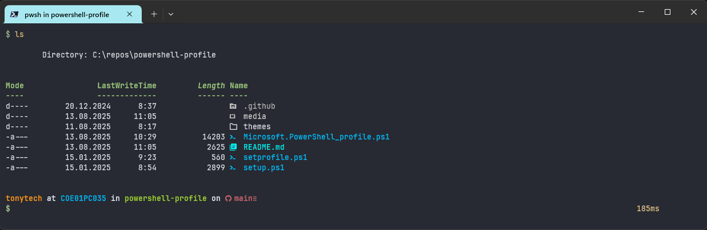

[](https://github.com/tonytech83/powershell-profile/actions/workflows/main.yml)

<h1 align="center">
PowerShell Profile
</h1>

**_Transform your Windows PowerShell into a powerful, beautiful, and productive terminal environment that rivals the best Linux shells. This comprehensive PowerShell profile brings together modern tools, elegant themes, and productivity-enhancing features to create a seamless command-line experience._**

- JetBrainsMono Nerd Font
- Oh My Posh
- Terminal Icons module
- fzf (fuzzy finder)
- zoxide (smart cd command)



#### Themes:

**_minimal.toml_**


**_minimal_one.toml_**


**_tonytech.omp.json_**


<hr>

### Prerequisites

- **Windows 10/11** with PowerShell 7+ installed
- **Administrator privileges** (required for setup script)

---

### Installation

#### Execute the following command in an elevated PowerShell window to install the PowerShell profile:

#### Stable Branch (Recommended)

```powershell
irm "https://github.com/tonytech83/powershell-profile/raw/main/setup.ps1" | iex
```

#### Dev Branch

```powershell
irm "https://raw.githubusercontent.com/tonytech83/powershell-profile/refs/heads/dev/setup.ps1" | iex
```

#### **Important**: Restart your PowerShell terminal to apply all changes.

---

### Common Issues

**Theme not loading:**

- Ensure you've restarted PowerShell after installation

**Setup script fails:**

- Make sure to run PowerShell as Administrator
- Check your internet connection for downloading dependencies
- If winget is not available, install it from Microsoft Store

**Profile not loading:**

- Check if the profile file exists: `Test-Path $PROFILE`
- Verify the profile path: `$PROFILE`
- Manually source the profile: `. $PROFILE`

### Getting Help

For more help or to report issues, please check the [GitHub repository](https://github.com/tonytech83/powershell-profile/issues).
